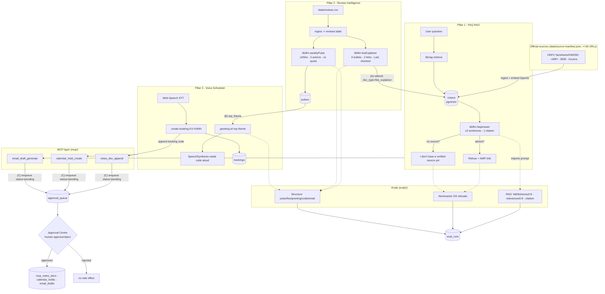

# Architecture — Mutual Fund Advisor Intelligence Suite

## 1. Purpose
A voice-first mutual fund **support** assistant (facts only, no advice) built
from three pillars that share one Supabase database, one RAG corpus, and one
human-approval gate for all outbound/side-effecting actions.

- **Pillar 1 — FAQ Chatbot (RAG):** factual scheme answers, exactly one
  citation, ≤3 sentences, refuses advice, never fabricates.
- **Pillar 2 — Review Intelligence:** ingests a reviews CSV → Weekly Pulse +
  Fee Explainer. The Fee Explainer is appended to the RAG corpus.
- **Pillar 3 — Voice Scheduler:** browser STT/TTS booking, emits a
  `KV-XNNN` code, greeting references the current Pulse top theme.

Cross-cutting: an **MCP layer** (3 tools) whose every action lands in a
**pending Approval Centre queue** and executes only on human approval.

> Stack note: Next.js 16 (App Router, Turbopack) + React 19 + TS6 + Tailwind v4.
> (Original spec said Next 14; deps were bumped to latest on request.)

## 2. Components & responsibilities

| Unit | Responsibility | Depends on |
|------|----------------|-----------|
| `app/` (FAQ UI) | chat surface, renders single citation | `lib/rag`, `lib/llm` |
| `app/` (Reviews UI) | shows Pulse + Fee Explainer + "refresh corpus" action | `lib/reviews`, `lib/llm` |
| `app/` (Voice UI) | Web Speech STT/TTS, reads booking code aloud | `lib/voice`, latest pulse |
| `app/` (Approval Centre) | lists `approval_queue`, approve/reject → executes MCP tool | `mcp/`, `lib/db` |
| `app/` (Dashboard) | unified view across pillars + eval run results | `lib/db` |
| `lib/llm/` | every OpenAI generation call + its **named prompt export** (shared with evals) | OpenAI SDK |
| `lib/rag/` | embed (OpenAI), upsert/query `corpus` (pgvector) | OpenAI SDK, `lib/db` |
| `lib/db/` | Supabase clients (anon + service role) | `@supabase/supabase-js` |
| `mcp/` | MCP server exposing 3 tools; each **enqueues**, never executes | `lib/db` |
| `evals/` | RAG / adversarial / structure evals via npm scripts | `lib/llm` prompts |

**Isolation rule:** prompts live as named exports in `lib/llm/` so evals
import the *exact* production prompt — no drift between what ships and what's
measured.

## 3. The three invariant data flows

### (A) Pulse → FAQ corpus refresh
Review Intelligence generates a **Fee Explainer**, which is written into the
**single `corpus` table** as a row with `doc_type='fee_explainer'` (embedded
like any other doc). The FAQ bot retrieves it on the next query with no code
change. This is the *only* refresh mechanism, and it is demonstrable: insert →
re-query → the explainer appears as a citable source.

### (B) Pulse → voice-greeting injection
The Voice Scheduler reads the **latest `pulses` row** and interpolates
`top_theme` into its greeting template before speaking. New Pulse → new
greeting, no redeploy.

### (C) MCP approval gate
Every MCP tool call (`notes_doc_append`, `calendar_hold_create`,
`email_draft_generate`) inserts a row into `approval_queue` with
`status='pending'` and returns that action id. The side-effect tables
(`mcp_notes_docs`, `calendar_holds`, `email_drafts`) are written **only** when
a human approves in the Approval Centre. There is no path that executes a tool
without an approval transition.

## 4. Data-flow diagram

## 5. Where each requirement is enforced
- **One citation / ≤3 sentences / advice refusal** → `lib/llm/faqAnswer` prompt
  + Zod schema; verified by RAG + adversarial evals.
- **Corpus refresh visible** → `corpus` insert with `doc_type='fee_explainer'`,
  surfaced in the Reviews UI "refresh" action and re-query demo.
- **Greeting uses top theme** → Voice UI reads latest `pulses.top_theme`;
  structure eval asserts the theme string is present.
- **Approval before execution** → `approval_queue` state machine; no direct
  writes to side-effect tables outside the approve transition.
- **No PII** → ingestion strips/skips PII; prompts forbid emitting it; voice
  deflects; evals scan outputs.

## 6. Error handling
- LLM JSON: Zod-validate → retry once → surface error (never accept malformed).
- Corpus miss: explicit "no verified source" message, never a guess.
- MCP tool failure post-approval: action stays `approved`, records `result`
  error, no partial side effect.
